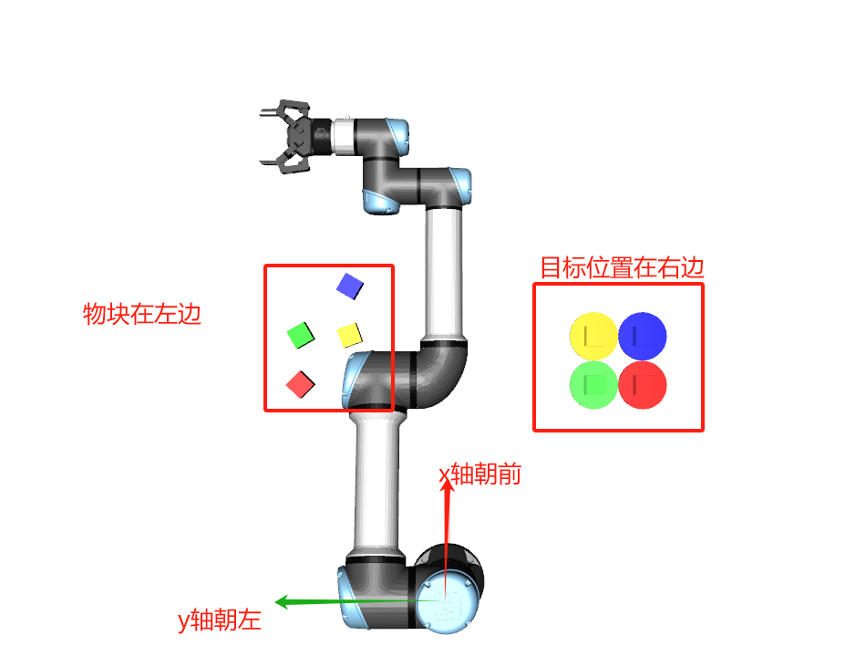

## 任务描述

- 需要从摄像头获取图片，然后从图片中获取物块的位置和方向，进而控制机械臂运动到物块的位置进行夹取
- 需要从摄像头获取图片，然后从图片中获取圆盘的位置，进而控制机械臂将物块放置到对应颜色的圆盘上，尽可能与透明的目标位置重合。
- **橙色的物块在最后评测时会被替换成红、绿、蓝这三种颜色其中的一种，需要你在代码中考虑这种变化情况**




## 注意事项

1. 独立完成，禁止抄袭，一经发现，取消成绩，代码会被仔细阅读，不要抱有侥幸心理
2. 不能直接调用`mujoco`中获取物块和圆盘位置的方法，一经发现，取消成绩
3. 只需上交`main.py`文件，因此不要对其他文件进行修改，除非处于调试的需要
4. 物块只有正方体，边长 4cm，且只会出现在相机的左边视野内，位置和方向随机
5. 圆盘只会出现在相机的右边视野内，物块的目标方向固定朝前，物块和圆盘的颜色在最终测试时只有红、绿、蓝 3 种

## 环境搭建

1. 使用 conda 创建虚拟环境

```
# 创建虚拟环境
(base) C:\Users\18171>conda create -n PythonEnv python=3.8

# 查看已有的环境（目前处于base环境中）
(base) C:\Users\18171>conda env list
# conda environments:
#
PythonEnv                C:\Users\18171\.conda\envs\PythonEnv
base                  *  E:\software\anaconda3

# 激活环境
(base) C:\Users\18171>conda activate PythonEnv
# 切换到PythonEnv环境中
(PythonEnv) C:\Users\18171>

# 安装mujoco和其他依赖包
(PythonEnv) C:\Users\18171>pip install mujoco
(PythonEnv) C:\Users\18171>pip install opencv-python
```

2. 在 Pycharm 中使用虚拟环境

(1) 在 JetBrains 官网下载 Pycharm 社区版，打开后创建一个新项目，填写项目名称，例如`RoboTask`，放在合适的文件下


(2) 选择刚才创建的 conda 环境


(3) 把`XRobot`文件夹拷贝到`RoboTask`文件夹下，右键运行`demos/main.py`


也可以等项目创建完之后在`Settings`中的`Python Interpreter`选择 conda 环境


## 在 VS code 中运行代码

在`RobotTask`文件夹下新建`.vscode`文件夹，新建 2 个文件

`launch.json`

```json
{
  "version": "0.2.0",
  "configurations": [
    {
      "env": { "PYTHONPATH": "${workspaceRoot}" }
    }
  ]
}
```

`settings.json`

```json
{
  "terminal.integrated.env.windows": {
    "PYTHONPATH": "${workspaceFolder};${env:PYTHONPATH}"
  }
}
```

安装 python 插件，右下角选择刚才创建的 python 环境，右上角点击运行


或者直接在终端运行，注意替换成自己的路径，路径不要有中文

```shell
PS D:\RobotTask> & C:/Users/xxx/.conda/envs/PythonEnv/python.exe d:/xxx/RobotTask/XRobot/demos/main.py
```

## 参考代码

1. 坐标转换

```py
import numpy as np
from XRobot.commons.cv_utils import get_cam_intrinsic

def get_pos(point):
    """
    将相机坐标系转换到世界坐标系
    :param point: 相机坐标系下的坐标, (x_c, y_c, 1, 1)
    :return: 世界坐标系下的坐标, (x_w, y_w, 1, 1), 这里只需要x_w和y_w
    """
    K = get_cam_intrinsic() # 相机内参
    T = np.array([[0, 1, 0, 0.5],
                  [-1, 0, 0, 0],
                  [0, 0, 1, 0.8],
                  [0, 0, 0, 1]]) # 相机外参
    K_inv = np.linalg.inv(K)    # 求逆矩阵
    return T @ K_inv @ point
```

2. 获取相机图片并保存

```py
import cv2

cv_image = env.render("rgb_array")
cv2.imwrite("image.png", cv_image)
```

3. 控制机械臂运动到指定位置

```py
import XRobot.commons.transform as T
import numpy as np

q = T.euler_2_quat(np.array([0, 0, angle * np.pi / 180]))   # q: (x, y, z, w)
action = np.array([x, y, 0.1, q[3], q[0], q[1], q[2]])  #四元数的顺序变成 (w, x, y, z)

for t in range(int(200)):   # 给定一个运行到该位置的时间
    env.robot.end['arm0'].open()    # 打开夹爪
    env.step(action)

action[2] = 0.02    # 0.02是可以夹住物块的高度
for t in range(int(100)):
    env.step(action)    # 末端从0.1运动到0.02

for t in range(int(20)):
    env.robot.end['arm0'].close()   # 关闭夹爪
    env.step(action)    # 这里还是需要执行action才能保持机械臂末端位置不动
```

4. 需要调试的话可以修改`assets/objects/cube/box.xml`，在在`pos="0.5 0.2 0.1" quat="0.985 0 0 0.174"`部分修改位置和方向，在`rgba="0 0 1 0.5"`部分修改颜色

```xml
<body name="orange_block" pos="0.5 0.2 0.1" quat="0.985 0 0 0.174">
    <freejoint/>
    <geom size="0.02 0.02 0.02" rgba="1 0.5 0 1" type="box" conaffinity="0" contype="0" group="1"/>
    <geom size="0.02 0.02 0.02" type="box" conaffinity="1" condim="4" contype="1" group="4" mass="0.0001" friction="1 0.005 0.0001" solimp="1 1 1" solref="0.00001 1"/>
    <site name="orange_block" pos="0 0 0" size="0.02" rgba="0 0 1 0.5" type="sphere" />
</body>
```
